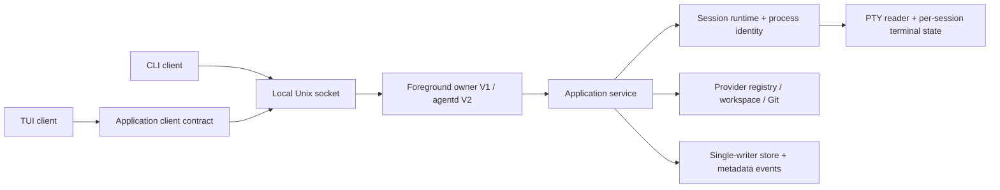

# Kế hoạch triển khai Agent Session Deck

Nguồn yêu cầu: [PRODUCT.md](../../../PRODUCT.md). Ngày lập: 2026-09-28.

Repo tại thời điểm lập kế hoạch chỉ có bản đặc tả sản phẩm; chưa có mã nguồn, Go module hay test. Bộ tài liệu này là kế hoạch thực thi, **không phải báo cáo các tính năng đã hoàn thành**. Tất cả stage đang ở trạng thái `PLANNED`. Ngôn ngữ tài liệu là tiếng Việt; tên API, package và CLI giữ tiếng Anh.

## Mục tiêu và các mốc bàn giao

- **M0 — nền tảng đã kiểm chứng:** Stage 00–01. Chốt semantics sản phẩm, chứng minh PTY + terminal rendering hoạt động, dựng nền build/test.
- **M1 — lát cắt chạy được:** Stage 02–06. Từ CLI chạy fake/generic agent, tương tác, detach/open, stop/restart, đọc trạng thái từ terminal khác.
- **M2 — V1 dùng hằng ngày:** Stage 07–10. TUI đầy đủ, provider có bằng chứng tương thích, recovery, bản phát hành Linux có tài liệu và kiểm thử.
- **M3 — V2 control plane:** Stage 11–13. Daemon, workspace dashboard, metrics và lịch sử bền vững.
- **M4 — V3 programmable platform:** Stage 14–15. MCP được giới hạn quyền, workspace profiles và automation opt-in.

V1 là sản phẩm hoàn chỉnh theo phạm vi V1 trong PRODUCT, không phải demo. V2/V3 là các đợt mở rộng độc lập; không cần hoàn thành chúng để phát hành V1. Trước khi bắt đầu mỗi đợt, đối chiếu lại nhu cầu thực tế và cập nhật kế hoạch.

## Danh sách stage

| Stage | Tài liệu | Phụ thuộc bắt buộc | Đầu ra quan sát được | Cỡ việc tương đối |
|---|---|---|---|---|
| 00 | [Product contracts và technical spikes](00-product-contracts-and-spikes.md) | Không | ADR, terminal spike, semantics rõ ràng | L |
| 01 | [Repository và engineering baseline](01-repository-and-engineering-baseline.md) | 00 | Build, CI, fake agent | S |
| 02 | [Domain và application contracts](02-domain-and-application-contracts.md) | 01 | State machine, service/port contracts | M |
| 03 | [Config và persistent state](03-config-and-persistent-state.md) | 02 | Config validation, store bền vững | M |
| 04 | [Discovery, providers và workspace](04-discovery-providers-and-workspaces.md) | 02, 03 | Agent registry, workspace/Git metadata | M |
| 05 | [PTY và session runtime](05-pty-and-session-runtime.md) | 02, 03; spec từ 00 | Runtime sở hữu process và terminal | L |
| 06 | [Foreground IPC và CLI](06-foreground-ipc-and-cli.md) | 03, 04, 05 | Toàn bộ CLI V1, single owner | L |
| 07 | [TUI launcher và session dashboard](07-tui-launcher-and-dashboard.md) | 06 | TUI launch/list/search/filter/actions | M |
| 08 | [Interactive terminal view](08-interactive-terminal-view.md) | 05, 06, 07 | Tương tác nhiều session đúng terminal | L |
| 09 | [Recovery và lifecycle hardening](09-recovery-and-lifecycle-hardening.md) | 06, 08 | Crash/quit/orphan/concurrency an toàn | L |
| 10 | [V1 acceptance và release](10-v1-acceptance-and-release.md) | 04, 07, 08, 09 | Artifact Linux + hướng dẫn + evidence | M |
| 11 | [V2 daemon và client migration](11-v2-daemon-and-client-migration.md) | 10 | Session sống khi TUI đóng | L |
| 12 | [V2 workspace và observability](12-v2-workspaces-and-observability.md) | 11 | Dashboard workspace và metrics | M |
| 13 | [V2 history và event persistence](13-v2-history-and-event-persistence.md) | 11; gate V2 cần 12 | History, retention, migration | M |
| 14 | [V3 MCP control plane](14-v3-mcp-control-plane.md) | 11, 12, 13 | MCP tools scoped, bounded I/O | L |
| 15 | [V3 profiles và automation](15-v3-profiles-and-automation.md) | 12, 13 cho core; gate V3 cần 14 | Profiles, opt-in triggers, V3 release | L |

S/M/L là độ phức tạp tương đối, chưa phải cam kết ngày công. Stage 00 và 05/08 có rủi ro kỹ thuật cao nhất; chỉ ước lượng thời gian sau spike. V1 có thể chia các stage lớn thành PR nhỏ theo checklist mà không đổi dependency.

## Quyết định kiến trúc đề xuất

Các quyết định dưới đây là **đề xuất để chốt tại Stage 00**, không tự động thay thế PRODUCT.md.

1. **V1 có một foreground owner cho mỗi ASD state home.** Tiến trình `asd` hoặc `asd new` đầu tiên giữ SessionManager, PTY và application service. Một Unix socket cục bộ cho CLI khác truy vấn/điều khiển cùng owner. Không tự chạy daemon nền ở V1. Khi không có owner, `new` có terminal tương tác sẽ trở thành owner; `new` không có TTY báo lỗi thay vì tạo process không có ai quản lý. `scan/list/inspect` có đường đọc offline.
2. **Đóng client khác detach; đóng owner cần quyết định về các session.** `q` khi owner còn session sống hiển thị Cancel hoặc Stop all and quit; không hứa session sống sau khi owner đóng. TERM/HUP có chính sách shutdown đã tài liệu hóa; SIGKILL/crash có thể làm mất PTY. V2 chuyển ownership sang `agentd`.
3. **PTY không phải terminal emulator.** Mỗi session cần parser/screen state riêng, cập nhật cả khi detach. Bubble Tea chỉ điều khiển UI; renderer và input adapter được spike riêng. Không dùng viewport chứa chuỗi ANSI như thể đó là terminal đầy đủ.
4. **Restart khác native resume.** Restart tạo execution attempt mới trong cùng logical session, chạy lại argv trong workspace; không tự nối tiếp conversation của vendor. `Resume` capability chỉ bật khi có adapter và bằng chứng tương ứng.
5. **Không suy luận IDLE từ im lặng.** Process lifecycle (`created/starting/running/stopping/exited/failed/unknown`) tách khỏi I/O (`attached/detached/unavailable`) và activity (`unknown/working/idle` khi provider có bằng chứng). ORPHANED là nhãn cho process còn sống nhưng PTY mất; giữ dữ kiện gốc khi trạng thái chưa xác minh.
6. **Single writer cho metadata.** Owner serialize mutations, có lock toàn bộ state home; CLI client không ghi JSON trực tiếp khi owner sống. Mỗi mutation có generation/revision và request ID nếu có khả năng retry.
7. **Linux trước.** Go + Cobra; Bubble Tea/Bubbles/Lip Gloss theo bộ major tương thích được pin tại Stage 01; PTY candidate `creack/pty`; Git CLI; JSON ở V1. Chỉ thêm SQLite ở Stage 13 nếu có nhu cầu và quyết định đo được. Không tạo `pkg/api` public sớm.
8. **State/config/runtime tách nhau theo XDG.** Đề xuất `~/.config/asd/config.yaml`, `~/.local/state/asd/{sessions,state}.json`, `$XDG_RUNTIME_DIR/asd/control.sock`. Nếu thay đổi vị trí mẫu trong PRODUCT, phải ghi ADR và hướng dẫn migration; không âm thầm bỏ qua dữ liệu cũ.

## Các chỗ PRODUCT cần làm rõ

| Điểm chưa nhất quán/thiếu | Cách xử lý trong plan | Stage chốt |
|---|---|---|
| Session được định nghĩa hai lần; `dead`, `EXITED`, `ORPHANED` chưa thống nhất | Một glossary và state table, giữ observed fact riêng | 00, 02 |
| `open/stop` từ process CLI khác nhưng daemon đến V2 | Foreground control socket; daemon survival đến V2 | 00, 06 |
| “Reconstruct state” sau crash có thể bị hiểu thành khôi phục PTY | Chỉ recover metadata + liveness; không tái tạo PTY đã mất | 00, 09 |
| Capabilities `Kill/SessionList` có thể nhầm core và provider | Lifecycle/list của ASD là core; native API là provider capability | 00, 04 |
| OMP/Orca có thể trùng executable khác | Provider phải xác minh identity; Orca có khả năng trùng screen reader | 04 |
| Discover workspace chưa có nguồn cụ thể | CWD, explicit path, configured/recent workspaces; không scan toàn disk | 04 |
| `history/workspace` trong final CLI nhưng mục V1 không yêu cầu | Basic past metadata ở V1; dedicated history ở V2; profiles ở V3 | 00, 13, 15 |
| Terminal emulation và shortcut collision chưa đặc tả | Compatibility matrix, prefix escape, input/resize contract | 00, 08 |
| License và Go module identity TBD | Maintainer chọn trước public release; không tự chọn quyền pháp lý | 01, 10 |

## Bản đồ coverage

| Yêu cầu PRODUCT | Stage thực thi | Bằng chứng tại milestone |
|---|---|---|
| §§7–9: discovery/generic/provider capability | 04 | Fake binary + provider smoke matrix tại 10 |
| §§10–12, 18–19: lifecycle/process/reconciliation | 02, 05, 09 | Child-process, PID reuse, crash suite |
| §§11, 15: workspace/Git/search/filter | 04, 07 | Git fixtures, fuzzy ranking, UX walkthrough |
| §§13, 40: CLI V1 | 06 | CLI contract + owner/client E2E |
| §§14, 16–17: TUI/new/interact | 07, 08 | PTY fixture + real terminal walkthrough |
| §§20–21: store/events | 03, 09, 13 | Atomic write/fault recovery + migration |
| §§28–31: permissions/errors/recovery | 03, 06, 08, 09, 14 | Invalid config, malformed IPC, crash cases |
| §23: complete V1 | 10 | V1 acceptance checklist |
| §24: daemon/workspace/metrics/history | 11, 12, 13 | V2 client-close/reopen acceptance |
| §§25–27: MCP/profiles/automation | 14, 15 | V3 policy/idempotency/opt-in acceptance |
| §§34–35: Linux/testing | 01, 05, 09, 10 | CI và fake agent không cần vendor auth |

## Cách thực thi một stage

1. Đọc PRODUCT, README này và file stage. Kiểm tra dependency đã có evidence, không chỉ đã merge.
2. Chia checklist thành task nhỏ, mỗi task một owner và phạm vi file cụ thể. Chốt API trước các task song song.
3. Triển khai cùng các test hành vi liên quan. Không để toàn bộ testing đến Stage 10.
4. Reviewer đối chiếu observable acceptance, quyền sở hữu process và lỗi hồi phục.
5. Lưu report tại `docs/plan/implementation/reports/stage-NN.md` khi stage thực sự được thực thi: thay đổi, lệnh kiểm tra, kết quả, giới hạn, quyết định mới và handoff.
6. Cập nhật trạng thái của stage và README thành `IN_PROGRESS`, `BLOCKED` với lý do cụ thể, hoặc `DONE` có link report. Không đánh dấu xong chỉ vì có scaffolding.

Không tạo report “đã hoàn thành” trong đợt lập kế hoạch này. Task phát sinh ngoài scope phải ghi dependency/scope mới trước khi tích hợp. Git branch khi cần dùng prefix `codex/`; không commit hay release nếu nhiệm vụ hiện tại chỉ yêu cầu lập kế hoạch.

## Multi-agent execution

Giới hạn đề xuất: một coordinator + tối đa ba worker. Với runtime hỗ trợ ít slot hơn, giảm worker; không tạo worker để chờ dependency. Có thể thực thi cả plan bằng một agent.

- Wave A: Stage 00 do một owner, reviewer độc lập xem ownership/lifecycle và terminal spike; Stage 01 tiếp sau.
- Wave B: Stage 02 chốt hợp đồng, Stage 03 chốt store; sau đó Stage 04 và 05 song song, reviewer làm fault-case matrix.
- Wave C: Stage 06 tích hợp; Stage 07 owner UI. Worker terminal có thể chuẩn bị adapter theo contract Stage 00/05, nhưng Stage 08 chỉ hoàn tất sau 07.
- Wave D: Stage 09 làm runtime/recovery; worker docs/release chuẩn bị Stage 10 sau khi command surface ổn định. Release chỉ khi 09 pass.
- Wave E: Stage 11 trước; Stage 12 và 13 có thể song song khi event schema đã freeze. Stage 14 và phần profile core của 15 song song sau V2; expose profile qua MCP sau 14.

Coordinator sở hữu `go.mod/go.sum`, `cmd/asd/main.go`, assembly ứng dụng, hợp đồng shared và tích hợp cuối. Worker không cùng sửa shared file: gửi yêu cầu dependency/API cho coordinator. Runtime owner giữ `internal/{process,pty,terminal,session}`; discovery owner giữ `internal/{providers,discovery,workspace,git}`; UI owner giữ `internal/{cli,tui}` theo task. Mỗi handoff nêu file sửa, command đã chạy, failure còn lại và API assumptions. Không hard-code Orca hoặc một coding agent thành dependency của sản phẩm/test.

## Rủi ro và release gates

| Rủi ro | Cách giảm thiểu | Gate |
|---|---|---|
| Full-screen agent không render/input đúng | Spike sớm, terminal fixtures + real agent matrix | 00 trước architecture freeze; 08 trước release |
| PID/PGID tái sử dụng, kill nhầm | Owner/attempt identity + starttime/boot ID; fail closed khi không chứng minh ownership | 05, 09 |
| Agent sinh process tách group | Document giới hạn process-group; test descendant; không claim cleanup toàn máy | 05, 09 |
| CLI/TUI cùng ghi state | Single owner lock và request serialization | 03, 06 |
| Output flood làm treo UI/runtime | Bounded parser queue, screen/scrollback caps, chậm render chứ không chặn drain PTY | 05, 08 |
| Owner crash mất PTY | Honest orphan/unknown state, không auto-attach hoặc auto-kill; V2 chỉ bảo đảm qua client close khi daemon sống | 09, 11 |
| Provider CLI đổi flags/version | Version pin trong matrix; mặc định argv tối thiểu; generic fallback | 04, 10 |
| MCP/automation tự ý chạy command | Configured IDs, scoped workspace, mutation policy, opt-in | 14, 15 |

Các budget đề xuất cần đo tại 00/10: scan <=2 giây với 10 candidate và version probes có timeout; input-to-screen p95 <=100 ms trong fake-agent workload; UI điều hướng p95 <=100 ms với 1.000 metadata records; scrollback mặc định <=2 MiB hoặc 10.000 dòng/session, chọn bound thực tế sau spike; 20 session output flood không tăng RAM vô hạn. Ghi CPU/máy/workload và số đo, không trình bày mục tiêu như benchmark đã đạt.

## Tài liệu kỹ thuật đã đối chiếu

Các nguồn dưới đây dùng để chọn hướng kỹ thuật, kiểm tra ngày 2026-09-28. Version cụ thể vẫn phải pin theo kết quả spike và compatibility.

- [Bubble Tea upstream](https://github.com/charmbracelet/bubbletea): framework nắm terminal I/O; kiểm tra major/import path trước khi tích hợp.
- [Charm x upstream](https://github.com/charmbracelet/x/blob/main/README.md): có candidate virtual terminal; cần kiểm chứng coverage, stability và license riêng.
- [creack/pty upstream](https://github.com/creack/pty): PTY, raw mode và resize; example không thay thế runtime production.
- [Cobra upstream](https://github.com/spf13/cobra): CLI subcommands, flags và help.
- [XDG Base Directory Specification](https://specifications.freedesktop.org/basedir/latest/): tách config/state/runtime.
- [Git status documentation](https://git-scm.com/docs/git-status): dùng porcelain/NUL output cho parser.
- [Linux /proc/PID/stat](https://man7.org/linux/man-pages/man5/proc_pid_stat.5.html): process identity/starttime cần cho reconciliation.
- [Official MCP Go SDK](https://github.com/modelcontextprotocol/go-sdk) và [protocol lifecycle](https://go.sdk.modelcontextprotocol.io/protocol/): nguồn primary để chọn version/transport ở Stage 14.
